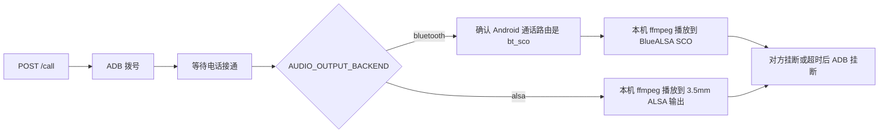

# AutoCallBot

AutoCallBot 是一个部署在树莓派上的单通道安卓自动外呼服务。

当前模型：



只做 `手机A -> 树莓派A`，不做多手机池、不做任务状态库、不做外部 JSON 配置。

## 配置

直接改 [autocallbot/config.py](/Users/liuzhuo/code/AutoCallBot/autocallbot/config.py) 顶部变量：

```python
AUDIO_OUTPUT_BACKEND = "bluetooth"  # "bluetooth" 或 "alsa"
ADB_SERIAL = "10.0.0.117:5555"
PHONE_MAC = "B8:D4:3E:6A:AF:84"
AUDIO_ALSA_PCM = "plughw:CARD=Headphones,DEV=0"
MAX_PLAY_SECONDS = 300.0
```

`audio_path` 是树莓派本机可访问的音频路径，不是手机里的文件路径。MP3/WAV 都由 ffmpeg 播放。

音频输出后端：

- `AUDIO_OUTPUT_BACKEND = "bluetooth"`：走 BlueALSA SCO/HFP，要求手机通话音频路由切到蓝牙。
- `AUDIO_OUTPUT_BACKEND = "alsa"`：走本机 ALSA 输出，例如树莓派 3.5mm 耳机口，不再等待 Android `bt_sco` 路由。

## 启动

开发启动：

```bash
python -m venv .venv
source .venv/bin/activate
pip install -e .
uvicorn autocallbot.main:app --host 0.0.0.0 --port 8000
```

树莓派部署：

```bash
./scripts/deploy_pi.sh
```

部署脚本会安装 ADB、BlueALSA、ffmpeg、Python venv，并创建 `autocallbot.service`。

日常小改快速部署并重启：

```bash
./scripts/fast_deploy_pi.sh
```

快速部署脚本只同步当前项目文件并重启 `autocallbot.service`，不会重新安装系统依赖或重建 venv。默认树莓派地址是 `liuzhuo@10.0.0.113`，需要覆盖时可以这样跑：

```bash
PI_HOST=raspberry-pi ./scripts/fast_deploy_pi.sh
```

如果改了依赖或打包配置，需要顺手执行一次 editable install：

```bash
INSTALL_EDITABLE=1 ./scripts/fast_deploy_pi.sh
```

## 调用

```bash
curl -X POST http://127.0.0.1:8000/call \
  -H 'Content-Type: application/json' \
  -d '{"phone":"13800138000","audio_path":"/tmp/1779194620494.mp3","play_seconds":12}'
```

接口会等待本次外呼结束后返回最终结果。当前手机占用时返回 `409 busy`。

日志写入：

```text
data/logs/autocallbot.log
```

## 运行前检查

```bash
adb devices
bluealsa-aplay -L
aplay -L
```

关键条件：

- 蓝牙模式下，手机蓝牙详情里启用“通话音频”，通话中 Android 音频路由必须是 `bt_sco`。
- 蓝牙模式下，`bluealsa-aplay -L` 必须能看到配置的 `PHONE_MAC`、`PROFILE=sco` 和 `playback`。
- 3.5mm 模式下，`aplay -L` 必须能看到配置的 `AUDIO_ALSA_PCM`，默认是 `plughw:CARD=Headphones,DEV=0`。
- 接听方能听到树莓派播放的测试音或 MP3，才说明上行注入真正成功。

更完整的树莓派蓝牙配置和排障见 [docs/raspberry-pi-bluetooth-headset-runbook.md](/Users/liuzhuo/code/AutoCallBot/docs/raspberry-pi-bluetooth-headset-runbook.md)。
