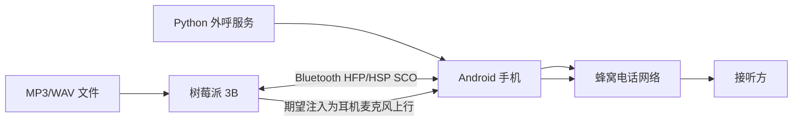

# 树莓派 3B 模拟蓝牙耳机外呼可行性验证方案

## 1. 目标

把树莓派 3B 配置成一台手机可连接的“蓝牙耳机/免提设备”，手机拨打蜂窝电话时选择该蓝牙设备作为通话音频，然后由树莓派向通话链路注入预录音频，同时尽量支持录取通话下行音频。

本方案目前用于可行性验证，不建议直接作为生产方案。

## 2. 结论先行

技术上可以让树莓派 3B 被手机识别成蓝牙音频设备，但“能连上蓝牙耳机”不等于“能稳定把 MP3 注入到通话上行麦克风”。

推荐判断标准：

| 能力 | 可行性 | 说明 |
| --- | --- | --- |
| 手机发现并配对树莓派 | 高 | BlueZ 可实现可发现、可配对 |
| 手机把树莓派当作通话蓝牙设备 | 中 | 取决于 HFP/HSP profile 暴露是否正确、手机系统是否接受 |
| 树莓派录到电话下行音频 | 中高 | HFP SCO capture 打通后一般可录 |
| 树莓派播放音频进入电话上行 | 中低 | 关键风险点，很多组合里 BlueALSA playback 不一定进入手机通话麦克风上行 |
| 长时间稳定商用 | 低到中 | 需要专用硬件或更底层蓝牙音频栈验证 |

更稳的生产方向仍然是 SIP/VoIP 或专用 GSM/VoLTE 网关；树莓派蓝牙耳机方案适合先做实验验证。

## 3. 推荐硬件

最低配置：

- Raspberry Pi 3B
- Raspberry Pi OS Lite 64-bit 或 32-bit
- 稳定电源，建议 5V 2.5A
- 手机一台，用于蜂窝电话外呼

建议额外准备：

- 可选 USB 蓝牙 4.0/5.0 适配器一只，用于替换排查
- USB 声卡一只，用于后续模拟音频线方案
- 3.5mm 音频线、隔离变压器或衰减线，用于硬件注入备选方案

树莓派 3B 自带蓝牙，建议先用板载蓝牙做第一轮验证。不要一开始就默认 USB 蓝牙更稳定。

板载蓝牙的优点：

- 少一个 USB 兼容性变量。
- Raspberry Pi OS 对板载蓝牙的基础支持更一致。
- 配对、可发现、HFP profile 暴露更容易先跑通。

板载蓝牙的风险：

- 3B 的板载蓝牙和 Wi-Fi 共享资源，稳定性受环境影响。
- SCO/HFP 音频链路对蓝牙控制器和驱动兼容性比较敏感。

USB 蓝牙只建议作为第二步排查手段。它的好处是容易替换，但不是天然更稳。尤其一些便宜 CSR clone 蓝牙棒，可能出现：

- 手机一直搜不到设备；
- 配对界面卡住；
- Linux 侧显示 `Connected: yes`，手机侧却显示未连接；
- `discoverable on` / `pairable on` 状态异常；
- SCO 音频 PCM 能出现，但通话中频繁掉回听筒。

如果 USB 蓝牙出现这些现象，优先退回树莓派 3B 板载蓝牙验证。

## 4. 软件组件

核心组件：

- BlueZ：Linux 蓝牙协议栈
- BlueALSA：把蓝牙音频暴露成 ALSA PCM 设备
- ffmpeg：播放 MP3/WAV 并重采样到 SCO 需要的格式
- alsa-utils：`aplay`、`arecord`、`amixer`

安装命令：

```bash
sudo apt update
sudo apt install -y bluez bluez-alsa-utils alsa-utils ffmpeg
sudo systemctl enable --now bluetooth
sudo systemctl enable --now bluealsa
```

## 5. 蓝牙角色说明

手机在通话场景中通常是 Audio Gateway，也就是 HFP AG。

树莓派需要模拟的是耳机侧，也就是：

- HFP HF：Hands-Free
- 或 HSP HS：Headset

目标链路如下：



要特别注意方向：

- 手机到树莓派：通话下行，树莓派应该能 capture。
- 树莓派到手机：耳机麦克风上行，树莓派需要 playback 到正确的 SCO 方向。

这两个方向必须分别验证。

## 6. BlueALSA 配置

建议先只开启 HFP HF，避免手机退到 HSP 或 A2DP 路由导致测试混乱。

创建 systemd override：

```bash
sudo mkdir -p /etc/systemd/system/bluealsa.service.d
sudo tee /etc/systemd/system/bluealsa.service.d/override.conf >/dev/null <<'EOF'
[Service]
ExecStart=
ExecStart=/usr/bin/bluealsa -p hfp-hf --initial-volume=100 --keep-alive=5
EOF

sudo systemctl daemon-reload
sudo systemctl restart bluealsa
```

如果还要让手机把树莓派识别成媒体设备，可临时加上 A2DP：

```bash
ExecStart=/usr/bin/bluealsa -p a2dp-source -p a2dp-sink -p hfp-hf --initial-volume=100 --keep-alive=5
```

但外呼通话实验阶段建议先保持最小化，只测 HFP。

## 7. 配对流程

设置蓝牙名称：

```bash
sudo bluetoothctl
```

在交互界面执行：

```text
power on
system-alias AutoCallBot-BT
agent KeyboardDisplay
default-agent
pairable on
discoverable-timeout 0
discoverable on
show
```

手机侧搜索 `AutoCallBot-BT` 并发起配对。

如果出现配对码，在树莓派 `bluetoothctl` 界面确认：

```text
yes
```

配对成功后信任手机：

```text
trust <PHONE_MAC>
info <PHONE_MAC>
```

## 8. 验证蓝牙音频 profile

查看 BlueALSA 暴露的 PCM：

```bash
bluealsa-aplay -L
```

理想情况下应看到类似：

```text
bluealsa:SRV=org.bluealsa,DEV=<PHONE_MAC>,PROFILE=sco
    <phone>, capture
    SCO (CVSD): S16_LE 1 channel 8000 Hz

bluealsa:SRV=org.bluealsa,DEV=<PHONE_MAC>,PROFILE=sco
    <phone>, playback
    SCO (CVSD): S16_LE 1 channel 8000 Hz
```

如果没有 `PROFILE=sco`，说明 HFP/HSP 没连起来，此时播放 MP3 没有意义。

## 9. 第一阶段：验证下行录音

手机拨通电话，并在通话界面选择 `AutoCallBot-BT`。

让接听方说话，树莓派执行：

```bash
arecord \
  -D 'bluealsa:SRV=org.bluealsa,DEV=<PHONE_MAC>,PROFILE=sco' \
  -f S16_LE -c 1 -r 8000 -d 8 \
  /tmp/hfp_capture.wav
```

查看音量：

```bash
ffmpeg -hide_banner -nostats \
  -i /tmp/hfp_capture.wav \
  -af volumedetect \
  -f null - 2>&1 | grep -E 'mean_volume|max_volume'
```

判定：

- 文件只有 44 字节：SCO capture 没真正打通。
- 有几十 KB 以上，且 `mean_volume/max_volume` 不是 `-inf`：树莓派能收到电话下行。

我们在当前服务器测试里曾录到约 69KB，`mean_volume: -28.3 dB`、`max_volume: -6.3 dB`，说明下行是可以打通的。

## 10. 第二阶段：验证上行注入

播放测试音：

```bash
ffmpeg -hide_banner -nostdin -re \
  -f lavfi -i 'sine=frequency=1000:sample_rate=8000' \
  -t 10 \
  -af 'volume=1.0' \
  -f alsa -ac 1 -ar 8000 \
  'bluealsa:SRV=org.bluealsa,DEV=<PHONE_MAC>,PROFILE=sco,VOL=100+,SOFTVOL=yes'
```

播放 MP3：

```bash
ffmpeg -hide_banner -nostdin -re \
  -i /tmp/1779194620494.mp3 \
  -af 'volume=4.0,aresample=8000' \
  -f alsa -ac 1 -ar 8000 \
  'bluealsa:SRV=org.bluealsa,DEV=<PHONE_MAC>,PROFILE=sco,VOL=100+,SOFTVOL=yes'
```

判定：

- 接听方能听到测试音：树莓派可用于外呼音频注入。
- 接听方听不到，但 capture 能录到下行：蓝牙 SCO 是通的，但 playback 方向没有进入手机麦克风上行。
- 手机路由掉回听筒：不是音频注入问题，是 HFP 路由不稳定。

## 11. Android 侧必须确认的状态

仅看通话 UI 上显示“蓝牙”不够，最好用 ADB 确认。

```bash
adb shell dumpsys telephony.registry | grep -E 'mCallState|mForegroundCallState'
adb shell dumpsys audio | grep -iE 'Actual mode|Active communication device|mBluetoothName|bt_sco'
```

理想状态：

```text
mCallState=2
mForegroundCallState=1
Actual mode = MODE_IN_CALL
Active communication device: ... type:bt_sco ...
mBluetoothName=AutoCallBot-BT
```

注意：

- `mCallState=2` 不一定代表接听方已经接通，拨号/振铃阶段也可能出现。
- 更稳的播放条件是 `mForegroundCallState=1` 且 `Active communication device` 是 `bt_sco`。

## 12. 常见问题

### 12.1 手机把树莓派识别成“计算机”

这通常说明 profile 暴露不完整，或配对时手机没有启用通话音频。

排查：

```bash
bluetoothctl show
bluealsa-aplay -L
```

手机蓝牙详情里需要看到“通话音频”可开启。如果“通话音频”是关闭或不可用，通话不会走树莓派。

### 12.2 服务器显示 connected，手机显示未连接

这是状态不一致，需要两边都清除配对：

树莓派：

```text
disconnect <PHONE_MAC>
remove <PHONE_MAC>
```

手机：

```text
蓝牙详情 -> 取消配对
```

然后重启蓝牙服务：

```bash
sudo systemctl restart bluetooth bluealsa
```

### 12.3 discoverable on 报 Busy

常见于 `bluetoothctl` 有残留进程或正在扫描。

处理：

```bash
sudo pkill -f bluetoothctl
sudo systemctl restart bluetooth
sudo bluetoothctl
```

交互执行：

```text
agent KeyboardDisplay
default-agent
pairable on
discoverable-timeout 0
discoverable on
```

### 12.4 BlueALSA playback 成功但对方听不到

这是本方案最大风险点。

需要确认三件事：

1. 手机通话路由确实是 `bt_sco`。
2. BlueALSA playback 路径是 `hfphf/sink`，不是 `hsphs/sink`。
3. 接听方在播放期间仍听不到测试音。

如果三项都成立，说明该手机/蓝牙栈/BlueALSA 组合无法把这路 playback 当成耳机麦克风上行。

### 12.5 USB 蓝牙配对卡住或手机发现不了

这种情况不要继续在同一个 USB 蓝牙棒上硬调太久。USB 蓝牙不稳定时，会把 HFP/SCO 问题和硬件兼容问题混在一起，导致判断失真。

建议按顺序处理：

1. 拔掉 USB 蓝牙，先用树莓派 3B 板载蓝牙验证配对和 HFP。
2. 清理手机侧旧配对记录。
3. 清理 Linux 侧旧设备记录：

```text
remove <PHONE_MAC>
```

4. 重启蓝牙服务：

```bash
sudo systemctl restart bluetooth bluealsa
```

5. 重新打开可配对：

```text
agent KeyboardDisplay
default-agent
pairable on
discoverable-timeout 0
discoverable on
```

如果板载蓝牙能稳定被发现和配对，而 USB 蓝牙不行，说明问题主要是 USB 蓝牙适配器或驱动兼容性，不应把它当作方案不可行的结论。

## 13. 可选替代方案

### 13.1 真实蓝牙耳机硬件 + 模拟音频注入

购买或拆改真实蓝牙耳机/车载免提模块，把树莓派音频输出接入耳机麦克风通道。

优点：

- 手机看到的是标准真实耳机。
- 兼容性比 Linux 模拟 profile 高。

缺点：

- 需要模拟电路处理麦克风电平。
- 可能需要隔离、衰减、阻抗匹配。

### 13.2 USB 声卡 + TRRS 线接入手机

如果手机支持有线耳机麦克风，可以通过 TRRS 麦克风通道注入音频。

优点：

- 比蓝牙 profile 更容易控制。

缺点：

- 新手机可能没有耳机孔。
- 需要 USB-C 音频转接和 CTIA 线序适配。

### 13.3 SIP/VoIP 外呼

用 SIP 网关或云通信平台拨号，Python 直接控制音频流。

优点：

- 音频注入是数字链路，最稳定。
- 可录音、ASR、并发、状态检测。

缺点：

- 需要运营商线路或合规云通信资源。
- 不再复用普通安卓手机蜂窝电话。

## 14. 推荐验证步骤

按这个顺序做，不要跳步：

1. 树莓派安装 BlueZ、BlueALSA、ffmpeg。
2. BlueALSA 只开启 `hfp-hf`。
3. 手机重新配对，确认“通话音频”开启。
4. 拨电话，确认 Android 是 `MODE_IN_CALL` + `bt_sco`。
5. 先录 `capture`，确认树莓派能收到下行。
6. 再播 1kHz 测试音，确认接听方是否听到。
7. 最后再播 MP3。

如果第 6 步失败，不建议继续在同一路径上投入太多时间，应转向真实蓝牙硬件注入或 SIP/VoIP。

## 15. MVP 集成思路

如果验证成功，可以把树莓派作为独立音频节点加入现有 AutoCallBot：


树莓派只负责音频播放和可选录音；拨号、状态判断、挂断仍由 Python/ADB 完成。

当前 MVP 建议固定为 `手机A -> 树莓派A`，先保证单链路稳定。不要在第一版里引入多手机共享一台树莓派、音频节点池或蓝牙适配器调度。

## 16. 当前阶段建议

树莓派 3B 值得试，第一轮建议直接用板载蓝牙。不要默认 USB 蓝牙更稳定；如果 USB 蓝牙出现发现不了、配对卡住、状态不同步，先退回板载蓝牙。

判断是否继续的关键不是“能不能配对”，而是：

- 通话中能否稳定保持 `bt_sco`；
- 树莓派能否录到下行；
- 播放测试音时接听方能否听到。

只要测试音上行成功，再考虑 MP3、自动化、稳定性和批量外呼。
