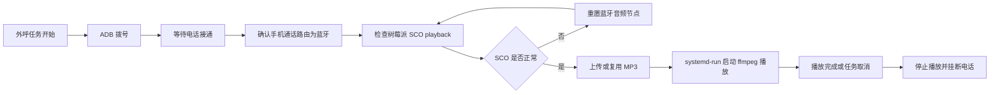

# 树莓派蓝牙耳机外呼音频注入跑通指引

更新时间：2026-05-20 09:10 CST

本文记录本次已经跑通的树莓派蓝牙耳机链路，用于后续代码实现前对齐环境、命令、验证点和自动化边界。原理和风险说明见 `docs/raspberry-pi-bluetooth-headset-feasibility.md`，本文只保留可执行操作。

## 1. 当前已验证结论

已验证树莓派可以作为 `AutoCallBot-BT` 被手机连接，并且 BlueALSA 暴露了可用的 SCO `capture` 和 `playback`。MP3 已经可以通过 `ffmpeg` 播放到 BlueALSA HFP HF sink，实测打电话时音频链路走通。

当前设备状态：

| 项 | 值 |
| --- | --- |
| 树莓派 SSH 用户 | `liuzhuo` |
| 树莓派当前 WiFi IP | `10.0.0.16` |
| 蓝牙设备名 | `AutoCallBot-BT` |
| 已配对手机 | `vivo S9` |
| 手机蓝牙 MAC | `B8:D4:3E:6A:AF:84` |
| BlueALSA profile | `hfp-hf` |
| SCO 编码 | `mSBC` |
| SCO 采样率 | `16000 Hz` |
| 测试音频 | `/tmp/1779194620494.mp3` |

注意：文档不要记录 WiFi 密码、sudo 密码、SSH 私钥等敏感信息。

## 2. 树莓派基础配置

安装组件：

```bash
sudo apt update
sudo apt install -y bluez bluez-alsa-utils bluez-tools alsa-utils ffmpeg
sudo systemctl enable --now bluetooth
sudo systemctl enable --now bluealsa
```

`bluez-tools` 提供 `bt-agent`，用于常驻处理手机配对请求。没有常驻 agent 时，手机可能能搜到 `AutoCallBot-BT`，但配对阶段失败或超时。

## 3. sudo 与 WiFi

本次为了方便后续远程执行，已将 `liuzhuo` 配置为免密码 sudo：

```bash
sudo tee /etc/sudoers.d/99-liuzhuo-nopasswd >/dev/null <<'EOF'
liuzhuo ALL=(ALL:ALL) NOPASSWD:ALL
EOF
sudo chmod 0440 /etc/sudoers.d/99-liuzhuo-nopasswd
sudo visudo -cf /etc/sudoers.d/99-liuzhuo-nopasswd
```

验证：

```bash
ssh liuzhuo@10.0.0.16 'sudo -n true && echo SUDO_NOPASSWD_OK'
```

WiFi 已连接到 `ZHT`，验证：

```bash
ssh liuzhuo@10.0.0.16 'nmcli -f DEVICE,TYPE,STATE,CONNECTION dev status; ip -br addr show wlan0'
```

期望看到：

```text
wlan0 wifi connected ZHT
wlan0 UP 10.0.0.16/24 ...
```

## 4. BlueALSA HFP HF 配置

只启用 `hfp-hf`，避免测试阶段被 A2DP/HSP 路由干扰：

```bash
sudo mkdir -p /etc/systemd/system/bluealsa.service.d
sudo tee /etc/systemd/system/bluealsa.service.d/override.conf >/dev/null <<'EOF'
[Service]
ExecStart=
ExecStart=/usr/bin/bluealsa -p hfp-hf --initial-volume=100 --keep-alive=5
EOF

sudo systemctl daemon-reload
sudo systemctl restart bluealsa
```

Debian 13 / BlueZ 5.82 下，BlueZ 自带 `audio-headset` 可能抢占 Hands-Free UUID，导致 BlueALSA 日志出现 `UUID already registered`。本次通过禁用 `audio-headset` 解决：

```bash
sudo mkdir -p /etc/systemd/system/bluetooth.service.d
sudo tee /etc/systemd/system/bluetooth.service.d/override.conf >/dev/null <<'EOF'
[Service]
ExecStart=
ExecStart=/usr/libexec/bluetooth/bluetoothd --noplugin=audio-headset
EOF

sudo systemctl daemon-reload
sudo systemctl restart bluetooth
sudo systemctl restart bluealsa
```

验证 BlueALSA 注册无冲突：

```bash
journalctl -u bluealsa -n 80 --no-pager | grep -E 'hands-free|UUID already registered|error|Error|failed|Failed'
```

期望不再出现新的 `UUID already registered`。

## 5. 常驻配对 agent

创建常驻 `bt-agent`：

```bash
sudo tee /etc/systemd/system/bt-agent.service >/dev/null <<'EOF'
[Unit]
Description=Bluetooth pairing agent for AutoCallBot
After=bluetooth.service
Requires=bluetooth.service

[Service]
Type=simple
ExecStart=/usr/bin/bt-agent -c NoInputNoOutput
Restart=always
RestartSec=2

[Install]
WantedBy=multi-user.target
EOF

sudo systemctl daemon-reload
sudo systemctl enable --now bt-agent
```

验证：

```bash
systemctl status bt-agent --no-pager -l
journalctl -u bt-agent -n 20 --no-pager
```

期望看到：

```text
Agent registered
Default agent requested
```

## 6. 开启可发现与配对

设置蓝牙名、可配对、可发现：

```bash
printf '%s\n' \
  'power on' \
  'system-alias AutoCallBot-BT' \
  'pairable on' \
  'discoverable-timeout 0' \
  'discoverable on' \
  'show' \
  'quit' | bluetoothctl
```

手机侧搜索 `AutoCallBot-BT` 并配对。若配对失败，先在手机侧忽略旧设备，再清理树莓派侧记录：

```bash
bluetoothctl devices
bluetoothctl remove <PHONE_MAC>
sudo systemctl restart bt-agent
```

配对成功后信任手机：

```bash
bluetoothctl trust B8:D4:3E:6A:AF:84
bluetoothctl info B8:D4:3E:6A:AF:84
```

期望：

```text
Paired: yes
Bonded: yes
Trusted: yes
Connected: yes
```

## 7. 验证 SCO profile

执行：

```bash
bluealsa-aplay -L
```

本次跑通结果：

```text
bluealsa:DEV=B8:D4:3E:6A:AF:84,PROFILE=sco,SRV=org.bluealsa
    vivo S9, trusted phone, capture
    SCO (mSBC): S16_LE 1 channel 16000 Hz

bluealsa:DEV=B8:D4:3E:6A:AF:84,PROFILE=sco,SRV=org.bluealsa
    vivo S9, trusted phone, playback
    SCO (mSBC): S16_LE 1 channel 16000 Hz
```

如果没有 `PROFILE=sco`，不要继续播放 MP3，先处理蓝牙连接或通话音频路由。

## 8. 上传并播放 MP3

从本机上传音频：

```bash
scp /Users/liuzhuo/Downloads/1779194620494.mp3 liuzhuo@10.0.0.16:/tmp/1779194620494.mp3
```

查看音频信息：

```bash
ssh liuzhuo@10.0.0.16 'ffprobe -hide_banner /tmp/1779194620494.mp3'
```

本次文件约 9 秒，24kHz mono MP3。播放到 SCO 时统一转为 16kHz mono。

10 分钟循环播放：

```bash
sudo systemd-run \
  --unit=autocallbot-mp3-loop \
  --description='AutoCallBot 10min MP3 loop to BlueALSA SCO' \
  --collect \
  --property=RuntimeMaxSec=610 \
  /usr/bin/ffmpeg \
    -hide_banner -nostdin \
    -stream_loop -1 -re \
    -i /tmp/1779194620494.mp3 \
    -t 600 \
    -af volume=4.0,aresample=16000 \
    -f alsa -ac 1 -ar 16000 \
    'bluealsa:SRV=org.bluealsa,DEV=B8:D4:3E:6A:AF:84,PROFILE=sco,VOL=100+,SOFTVOL=yes'
```

验证播放任务：

```bash
systemctl status autocallbot-mp3-loop.service --no-pager -l
journalctl -u autocallbot-mp3-loop.service -n 80 --no-pager
```

关键日志：

```text
/org/bluealsa/hci0/dev_B8_D4_3E_6A_AF_84/hfphf/sink: Starting
/org/bluealsa/hci0/dev_B8_D4_3E_6A_AF_84/hfphf/sink: Starting IO loop
```

停止播放：

```bash
sudo systemctl stop autocallbot-mp3-loop.service
```

## 9. 电话测试流程

1. 手机确认蓝牙已连接 `AutoCallBot-BT`。
2. 拨打电话。
3. 通话界面把音频路由切到 `AutoCallBot-BT` 或蓝牙。
4. 树莓派启动 MP3 循环播放。
5. 接听方确认能听到 MP3。

本次已确认该流程走通。

如果听不到声音，按顺序检查：

```bash
bluetoothctl info B8:D4:3E:6A:AF:84
bluealsa-aplay -L
systemctl status autocallbot-mp3-loop.service --no-pager -l
journalctl -u autocallbot-mp3-loop.service -n 80 --no-pager
```

常见判断：

- `bluealsa-aplay -L` 没有 `PROFILE=sco`：手机没有走 HFP/SCO，先重连蓝牙或切通话路由。
- service 没有 `hfphf/sink: Starting IO loop`：ffmpeg 没真正打开 SCO playback。
- service 正常但对方听不到：手机通话路由可能没有选到蓝牙，或该机型阻断 SCO playback 进入上行。

## 10. 稳定性维护与服务重启

蓝牙 HFP/SCO 链路长时间运行后可能出现手机显示已连、Linux 侧 profile 不完整、`bluealsa-aplay -L` 没有 `PROFILE=sco`、播放服务无法打开 `hfphf/sink` 等状态漂移。建议在每次批量外呼开始前重启相关服务；如果全天持续使用，也可以做低峰定时重启。

手动重启相关服务：

```bash
ssh liuzhuo@10.0.0.16 '
  sudo systemctl stop autocallbot-mp3-loop.service 2>/dev/null || true
  sudo systemctl restart bluetooth
  sleep 2
  sudo systemctl restart bluealsa
  sudo systemctl restart bt-agent
  sleep 2
  printf "%s\n" \
    "power on" \
    "system-alias AutoCallBot-BT" \
    "pairable on" \
    "discoverable-timeout 0" \
    "discoverable on" \
    "quit" | bluetoothctl
'
```

如果手机没有自动重连，手动连接已信任设备：

```bash
ssh liuzhuo@10.0.0.16 'bluetoothctl connect B8:D4:3E:6A:AF:84'
```

重启后验证：

```bash
ssh liuzhuo@10.0.0.16 '
  systemctl is-active bluetooth bluealsa bt-agent
  bluetoothctl info B8:D4:3E:6A:AF:84 | grep -E "Paired|Bonded|Trusted|Connected"
  bluealsa-aplay -L
'
```

期望看到：

```text
active
active
active
Paired: yes
Bonded: yes
Trusted: yes
Connected: yes
bluealsa:DEV=B8:D4:3E:6A:AF:84,PROFILE=sco,SRV=org.bluealsa
```

可选：创建一个本机维护脚本，便于代码或定时任务调用：

```bash
sudo tee /usr/local/bin/autocallbot-bt-restart.sh >/dev/null <<'EOF'
#!/bin/sh
set -e

systemctl stop autocallbot-mp3-loop.service 2>/dev/null || true
systemctl restart bluetooth
sleep 2
systemctl restart bluealsa
systemctl restart bt-agent
sleep 2

printf '%s\n' \
  'power on' \
  'system-alias AutoCallBot-BT' \
  'pairable on' \
  'discoverable-timeout 0' \
  'discoverable on' \
  'quit' | bluetoothctl >/dev/null || true

bluetoothctl connect B8:D4:3E:6A:AF:84 >/dev/null 2>&1 || true
bluealsa-aplay -L
EOF

sudo chmod +x /usr/local/bin/autocallbot-bt-restart.sh
```

手动执行：

```bash
sudo /usr/local/bin/autocallbot-bt-restart.sh
```

可选：每天凌晨定时重启蓝牙相关服务：

```bash
sudo tee /etc/systemd/system/autocallbot-bt-maintenance.service >/dev/null <<'EOF'
[Unit]
Description=Restart AutoCallBot Bluetooth audio services
After=network-online.target bluetooth.service

[Service]
Type=oneshot
ExecStart=/usr/local/bin/autocallbot-bt-restart.sh
EOF

sudo tee /etc/systemd/system/autocallbot-bt-maintenance.timer >/dev/null <<'EOF'
[Unit]
Description=Daily AutoCallBot Bluetooth audio maintenance

[Timer]
OnCalendar=*-*-* 03:30:00
Persistent=true

[Install]
WantedBy=timers.target
EOF

sudo systemctl daemon-reload
sudo systemctl enable --now autocallbot-bt-maintenance.timer
```

查看定时器：

```bash
systemctl list-timers autocallbot-bt-maintenance.timer
```

建议代码实现里也暴露一个“重置蓝牙音频节点”的管理动作，内部调用 `/usr/local/bin/autocallbot-bt-restart.sh`，用于外呼开始前或发现 SCO 缺失时自动恢复。

## 11. 代码实现建议

后续代码不建议直接散落 SSH 命令，建议抽象一个树莓派音频节点。

建议接口：

| 能力 | 命令/动作 |
| --- | --- |
| 健康检查 | `ssh pi 'sudo -n true; systemctl is-active bluetooth bluealsa bt-agent; bluealsa-aplay -L'` |
| 重置蓝牙音频节点 | `ssh pi 'sudo /usr/local/bin/autocallbot-bt-restart.sh'` |
| 上传音频 | `scp <local_mp3> liuzhuo@10.0.0.16:/tmp/autocallbot/<call_id>.mp3` |
| 检查 SCO | 解析 `bluealsa-aplay -L` 是否包含 `DEV=<PHONE_MAC>,PROFILE=sco` 和 `playback` |
| 开始播放 | `systemd-run --unit=autocallbot-play-<call_id> ... ffmpeg ...` |
| 停止播放 | `sudo systemctl stop autocallbot-play-<call_id>.service` |
| 查询播放状态 | `systemctl show autocallbot-play-<call_id>.service -p ActiveState -p SubState -p MainPID` |
| 查看日志 | `journalctl -u autocallbot-play-<call_id>.service -n 80 --no-pager` |

推荐调用顺序：



代码实现时建议把 `PHONE_MAC`、`PI_HOST`、`SCO_RATE`、音量倍数、最长播放时间做成配置项：

```text
PI_HOST=10.0.0.16
PI_USER=liuzhuo
PHONE_MAC=B8:D4:3E:6A:AF:84
BLUEALSA_PCM=bluealsa:SRV=org.bluealsa,DEV=B8:D4:3E:6A:AF:84,PROFILE=sco,VOL=100+,SOFTVOL=yes
SCO_RATE=16000
PLAYBACK_VOLUME=4.0
MAX_PLAY_SECONDS=600
```

实现时不要把 WiFi 密码、sudo 密码写入配置或日志。
